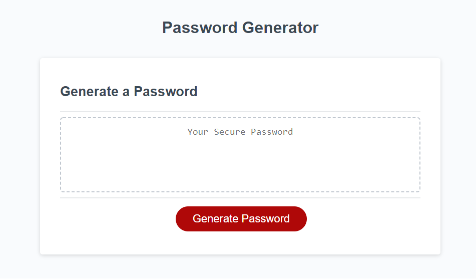
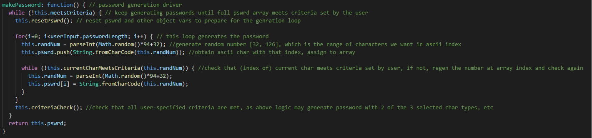
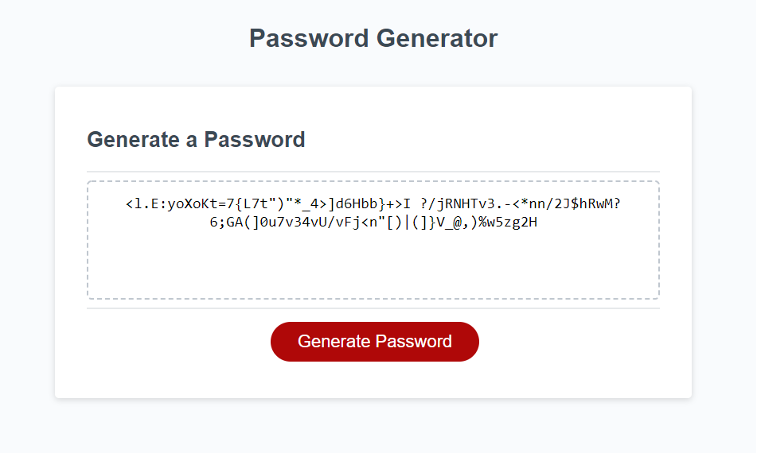

# 03-Password-Generator

## Criteria

[Link to live url](https://ddoherty6.github.io/03-Password-Generator/)

- This page includes
    - Page with space where password prints, and 'Generate Password' button
    - Button initiates a series of promts, asking user for details about the password such as:
        - The password length
            - The script ensures the user enters an integer between and including 8 and 128
        - The types of characters that will be in the password
            - The script does not allow the user to choose none of the character types
    - Page displays password once prompts are entered

        

## Development

Early development involved choosing how to handle tasks by grouping into objects. First the userInput object was written, then the gen object was written.

### Deployed Objects

The userInput object handles all interaction with the user. In the end it obtains 5 pieces of information: the number of characters in the password, and which of 4 character types will be included in the password.

The gen object drives all methods of password generation. It's central method, gen.makePassword(), calls all other methods in the object to drive the central logic behind creating the random password. This allows for a very clean call in the later function writePassword().

### Password Generation Algorithm

The password is generated by using the Math.random() function to determine a random index for an ASCII symbol. This symbol is then added to an array for tracking purposes. Originally, the algorithm would create the entire password, and then check to see if it met the criteria set by the user. If the citeria were not met, it would generate another password and so on. While theoretically at MVP stage at this point, the results of this algorithm were not practical for requested passwords beyond 20 or so characters. As the requested password length got larger, the odds of succesfully generating a password that met the given character-type criteria grew exponentially slim, putting unneeded stress on host computer processing the request.

The solution was to check each character index as it generated using gen.currentCharMeetsCritera(). If a given character does not meet criteria, the character at that index in the password array is regenerated until it does meet criteria.

In the end, gen.criteriaCheck() confirms that ALL criteria are met, as using the above method can theoretically result in only a subset of all user-selected criteria being met.

### Discrepancies

Provided code using the .addEventListener() funciton had to be commented out. It was calling the writePassword() funciton too early, before getLength() could be called to substantiate variables needed to run the Password Generation Algorithm. In the end, either .addEventListener() or .onclick() could be used in this situation.

## Future Development

This application, in its current form, cannot accommodate more than one password request in the same session. The user must refresh the browser to enter new criteria and regenerate a new password. Using javascript methods to add and remove an additional container inside class "card-body" seems to be the best approach here.